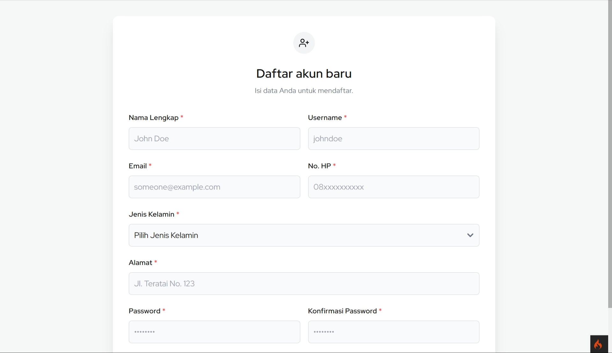

# UAS Pemograman Web 2

### Projek: Warung Online Bu Sri

<table>
  <thead>
    <tr>
      <th>Nama Anggota</th>
      <th>NIM</th>
      <th>Kelas</th>
      <th>GitHub</th>
    </tr>
  </thead>
  <tr>
      <td>Alif Nur Fathlii Amarta</td>
      <td>312210326</td>
      <td>TI.22.A3</td>
      <td><a href="https://github.com/alifamarta/" target="_blank">@alifamarta</a></td>
    </tr>
    <tr>
      <td>Galva Al-Ghozali</td>
      <td>312210356</td>
      <td>TI.22.A3</td>
      <td><a href="https://github.com/galvaal/" target="_blank">@galvaal</a></td>
    </tr>
    <tbody>
    <tr>
      <td>Rafif Isdarufa Athallah</td>
      <td>312210299</td>
      <td>TI.22.A3</td>
      <td><a href="https://github.com/zangetsuuuu/" target="_blank">@zangetsuuuu</a></td>
    </tr>
    <tr>
      <td>Wisnu Ikhwansyah Saputra</td>
      <td>312210305</td>
      <td>TI.22.A3</td>
      <td><a href="https://github.com/Wizzs1/" target="_blank">@Wizzs1</a></td>
    </tr>
  </tbody>
</table>

---

### Demo Program

### Link Website

### Screenshot

#### Halaman Pelanggan

#### Halaman Admin

